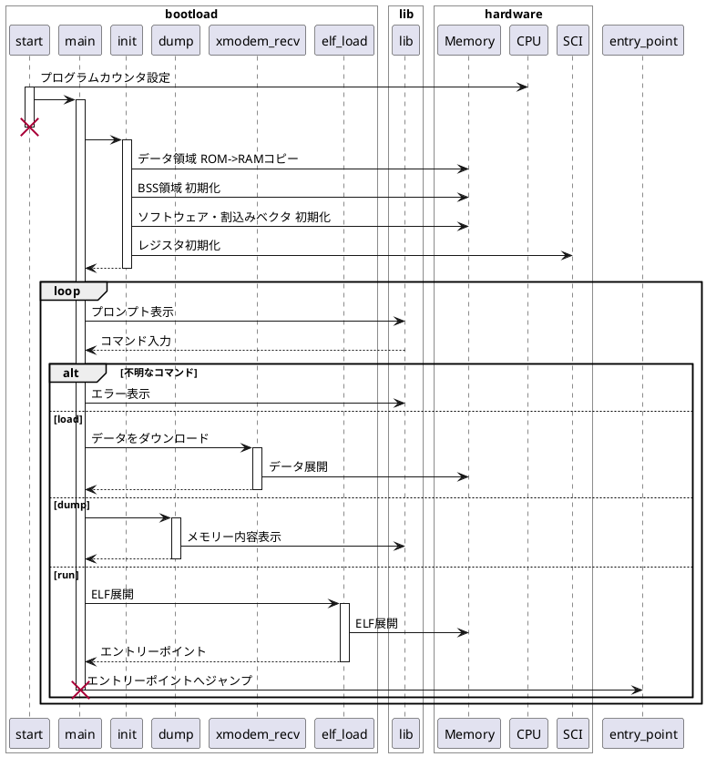

# KOZOSにおける割込み処理

## bootloadのシーケンス

bootload内では割込み処理は無効。

```puml
@startuml
box "bootload" #ffffff
participant start
participant main
participant init
participant dump
participant xmodem_recv
participant elf_load
end box

box "lib" #ffffff
participant lib
end box

box "hardware" #ffffff
participant Memory
participant CPU
participant SCI
end box

participant entry_point

start -> CPU : プログラムカウンタ設定
activate start
start -> main ++
destroy start
main -> init ++
init -> Memory : データ領域 ROM->RAMコピー
init -> Memory : BSS領域 初期化
init -> Memory : ソフトウェア・割込みベクタ 初期化
init -> SCI : レジスタ初期化
init --> main --

loop
    main -> lib : プロンプト表示
    lib --> main : コマンド入力

    alt 不明なコマンド
        main -> lib : エラー表示
    else load
        main -> xmodem_recv ++ : データをダウンロード
        xmodem_recv -> Memory : データ展開
        xmodem_recv --> main --
    else dump
        main -> dump ++
        dump -> lib : メモリー内容表示
        dump --> main --
    else run
        main -> elf_load ++ : ELF展開
        elf_load -> Memory : ELF展開
        elf_load --> main -- : エントリーポイント
        main -> entry_point : エントリーポイントへジャンプ
        destroy main
    end
end

skinparam shadowing false
skinparam BoxPadding 5
@enduml
```

