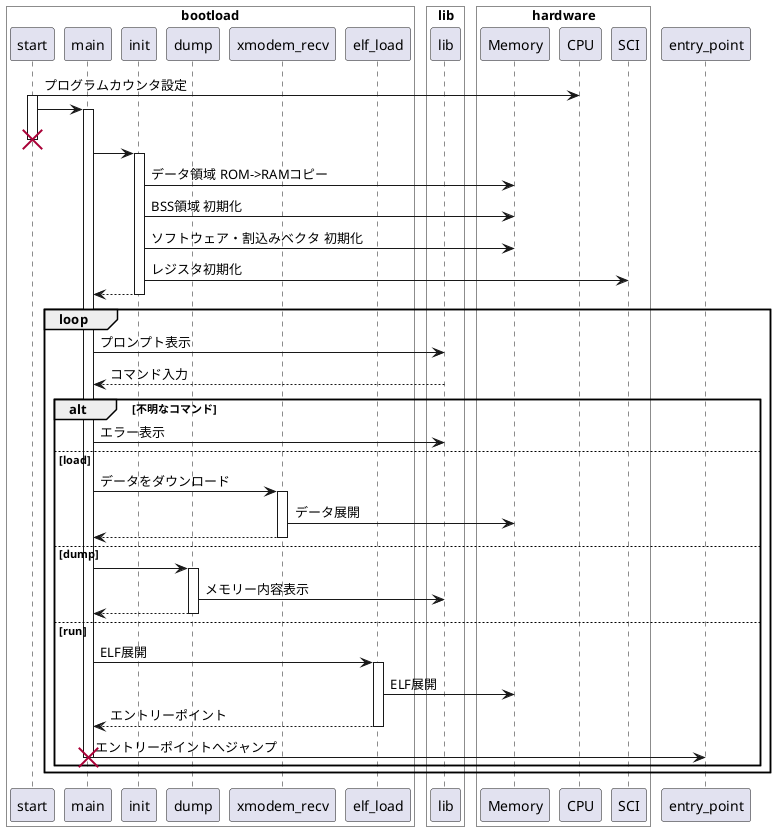
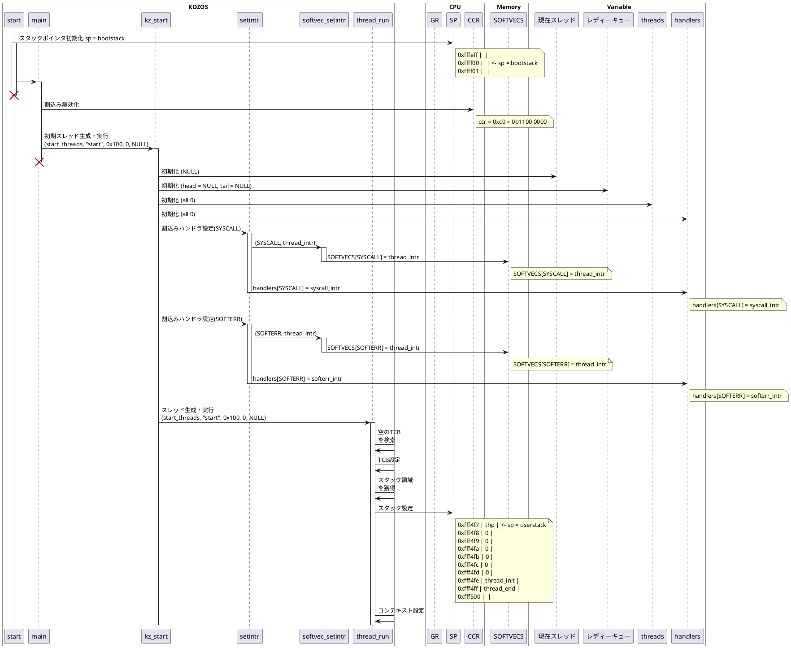

# KOZOSにおける割込み処理

## bootloadのシーケンス

bootload内では割込み処理は無効。

```puml
@startuml
box "bootload" #ffffff
participant start
participant main
participant init
participant dump
participant xmodem_recv
participant elf_load
end box

box "lib" #ffffff
participant lib
end box

box "hardware" #ffffff
participant Memory
participant CPU
participant SCI
end box

participant entry_point

start -> CPU : プログラムカウンタ設定
activate start
start -> main ++
destroy start
main -> init ++
init -> Memory : データ領域 ROM->RAMコピー
init -> Memory : BSS領域 初期化
init -> Memory : ソフトウェア・割込みベクタ 初期化
init -> SCI : レジスタ初期化
init --> main --

loop
    main -> lib : プロンプト表示
    lib --> main : コマンド入力

    alt 不明なコマンド
        main -> lib : エラー表示
    else load
        main -> xmodem_recv ++ : データをダウンロード
        xmodem_recv -> Memory : データ展開
        xmodem_recv --> main --
    else dump
        main -> dump ++
        dump -> lib : メモリー内容表示
        dump --> main --
    else run
        main -> elf_load ++ : ELF展開
        elf_load -> Memory : ELF展開
        elf_load --> main -- : エントリーポイント
        main -> entry_point : エントリーポイントへジャンプ
        destroy main
    end
end

skinparam shadowing false
skinparam BoxPadding 5
@enduml
```

## KOZOSの初期シーケンス

```puml
@startuml
box "KOZOS" #ffffff
participant start
participant main
participant kz_start
participant setintr
participant softvec_setintr
participant thread_run
end box

box "CPU" #ffffff
participant GR as gr
participant SP as sp
participant CCR as ccr
end box

box "Memory" #ffffff
participant SOFTVECS
end box

box "Variable" #ffffff
participant 現在スレッド as current
participant レディーキュー as readyque
participant threads
participant handlers
end box

start -> sp : スタックポインタ初期化 sp = bootstack
activate start
note right of sp
0xfffeff |  |
0xffff00 |  | <- sp = bootstack
0xffff01 |  |
end note

start -> main ++
destroy start
main -> ccr : 割込み無効化
note right of ccr : ccr = 0xc0 = 0b1100 0000
main -> kz_start ++ : 初期スレッド生成・実行\n(start_threads, "start", 0x100, 0, NULL)
destroy main

kz_start -> current : 初期化 (NULL)
kz_start -> readyque : 初期化 (head = NULL, tail = NULL)
kz_start -> threads : 初期化 (all 0)
kz_start -> handlers : 初期化 (all 0)

kz_start -> setintr ++ : 割込みハンドラ設定(SYSCALL)
setintr -> softvec_setintr ++ : (SYSCALL, thread_intr)
softvec_setintr -> SOFTVECS -- : SOFTVECS[SYSCALL] = thread_intr
note right of SOFTVECS : SOFTVECS[SYSCALL] = thread_intr
setintr -> handlers -- : handlers[SYSCALL] = syscall_intr
note right of handlers : handlers[SYSCALL] = syscall_intr

kz_start -> setintr ++ : 割込みハンドラ設定(SOFTERR)
setintr -> softvec_setintr ++ : (SOFTERR, thread_intr)
softvec_setintr -> SOFTVECS -- : SOFTVECS[SOFTERR] = thread_intr
note right of SOFTVECS : SOFTVECS[SOFTERR] = thread_intr
setintr -> handlers -- : handlers[SOFTERR] = softerr_intr
note right of handlers : handlers[SOFTERR] = softerr_intr

kz_start -> thread_run ++ : スレッド生成・実行\n(start_threads, "start", 0x100, 0, NULL)
thread_run -> thread_run : 空のTCB\nを検索
thread_run -> thread_run : TCB設定
thread_run -> thread_run : スタック領域\nを獲得
thread_run -> sp : スタック設定
note right of sp
0xfff4f7 | thp | <- sp = userstack
0xfff4f8 | 0 |
0xfff4f9 | 0 |
0xfff4fa | 0 |
0xfff4fb | 0 |
0xfff4fc | 0 |
0xfff4fd | 0 |
0xfff4fe | thread_init |
0xfff4ff | thread_end |
0xfff500 |  |
end note
thread_run -> thread_run : コンテキスト設定

skinparam shadowing false
skinparam BoxPadding 4
@enduml
```
